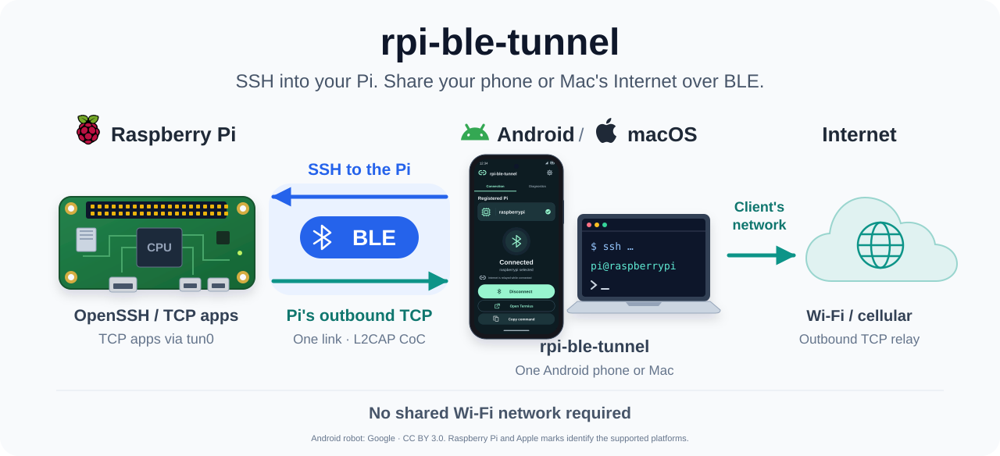

# rpi-ble-tunnel — BLE 経由のネットワークトンネル

[English (primary)](README.md) | 日本語

rpi-ble-tunnel は、BLE 経由で TCP 通信を可能とするライブラリです。Android スマートフォンや Mac から Pi に SSH で接続でき、Pi からはその端末の回線を使ってインターネットにアクセスできます。

Pi とクライアントが同じ Wi-Fi に接続している必要はありません。



- Android / Mac の SSH クライアントから、Pi の OpenSSH に接続できます。SCP・SFTP・rsync も利用できます。
- Pi の TCP アプリから、Android / Mac のインターネット回線を利用できます。アプリごとのプロキシ設定は不要です。

## 前提条件

| 対象 | 必要な環境 |
| --- | --- |
| Raspberry Pi | Raspberry Pi OS、Python 3.9 以上、Linux 5.3 以上、systemd、NetworkManager、BLE Peripheral / L2CAP CoC 対応アダプター。Pi Zero W / ARMv6 で動作確認 |
| Android | Android 10 / API 29 以上、BLE / L2CAP CoC 対応端末 |
| Mac | macOS 12 以上、Bluetooth |

インターネット通信の中継には、Android / Mac 側に Wi-Fi またはモバイル回線などのインターネット接続が必要です。SSH には別途 SSH クライアントと Pi のログイン情報を用意します。

以下はソースからビルドして導入する手順です。Pi の依存パッケージはインストーラーが導入します。クライアントのビルド・操作には次を準備してください。

| 対象 | ビルド・導入する端末に必要なもの |
| --- | --- |
| Android アプリ | シェルを使える Mac / Linux、JDK 17 以上、Android SDK 36、C コンパイラ、Python 3、SDK Platform-Tools の `adb`。Gradle Wrapper は同梱 |
| Mac クライアント | Xcode / Command Line Tools の Swift 5.9 以上、操作スクリプト用の Python 3 |

## インストール

このリポジトリを clone またはダウンロードし、Pi とクライアントのビルド用端末に配置します。以下のコマンドは、それぞれの端末でリポジトリのルートから実行してください。まず Pi に導入し、次に Android / Mac の使う側を導入します。

例の Pi ホスト名 `raspberrypi` と SSH ユーザー `pi` は、自分の環境の値に置き換えてください。

### Pi

Pi 上で実行します。初回は Pi 自身のインターネット接続と管理者権限が必要です。一般ユーザーでは管理操作に `sudo -n` を使うため、必要なら先に `sudo -v` で認証してください。

```bash
bash scripts/install-pi-network.sh
```

初回の長いビルド中に sudo の認証が切れた場合は、`sudo -v` の後に同じコマンドを再実行してください。ビルド済みの成果物は再利用されます。`sudo bash scripts/install-pi-network.sh` でビルドから導入まで root で実行することもできます。

依存導入・ビルド・テスト・サービス配置を行い、`rpi-ble-tunneld.service` を起動して自動起動を有効にします。更新も同じ手順です。更新中は BLE 接続が切れるため、管理用 LAN / USB SSH から実行してください。[更新・復旧の詳細](docs/operations.ja.md#更新とインストーラー)

Mac からソースを転送して導入することもできます。管理用 SSH の公開鍵認証・登録済みホスト鍵・Pi 側のパスワードなし sudo が必要です。Mac 上で実行します。

```bash
./scripts/deploy-pi.sh pi@raspberrypi.local
```

### Android

ビルド用 PC で実行します。[SDK Manager](https://developer.android.com/studio/intro/update#sdk-manager) で Android SDK Platform 36、Build-Tools 36.0.0、Platform-Tools を導入し、SDK のライセンスに同意してください。

JDK は `JAVA_HOME`、SDK は `ANDROID_HOME` または `android/local.properties` で指定し、`adb` を PATH に追加してください。Mac の標準位置にある Android Studio の JDK / SDK は自動検出します。Android 端末を USB 接続し、USB デバッグを有効にして PC からの接続を許可します。

```bash
./scripts/build-android.sh
./scripts/deploy-android.sh ADB_SERIAL
```

APK は `build/rpi-ble-tunnel-android-debug.apk` に保存されます。複数端末が接続されていなければ、配置時の `ADB_SERIAL` は省略できます。

### Mac

使用する Mac 上で実行します。Xcode / Command Line Tools が未導入なら、先に `xcode-select --install` を実行してください。`swift --version` で 5.9 以上であることを確認します。

```bash
./scripts/build-macos.sh
```

クライアントは `build/rpi-ble-tunnel.app` に保存されます。

## 使い方

### Android で接続

1. rpi-ble-tunnel の設定で「Piを登録」を開き、「付近のデバイス」の利用を許可して検索結果から Pi を選び、表示名を付けて保存します。「手動入力」ではホスト名だけを入力して検索できます。Bluetooth アドレスは選んだ端末から自動で取得します。Android 10 / 11 では位置情報の許可と位置情報 ON が必要です。
2. 接続画面で Pi を選んで「接続する」を押し、通知の許可を求められたら許可します。
3. 接続後、「Termiusで開く」または「コマンドをコピー」から SSH を使います。SSH の認証情報は使用する SSH クライアント側に登録します。

登録は Bluetooth アドレス単位で最大3件です。同じ Pi の内蔵・外付けアダプターを別々に登録でき、表示名とホスト名の重複も可能です。表示名は接続先の識別や SSH の HostKeyAlias に使いません。以前の登録にアドレスがない場合は、「接続する」からホスト名で再検索し、使用するアダプターを選んで保存します。

画面と通知は端末の言語設定に合わせて日本語または英語で表示します。日本語以外の言語では英語を使います。通信の診断ログは調査しやすいように英語で記録します。

設定画面の「省電力」は初期値が Off で、接続中にも変更できます。On にすると、Android 側の100msごとの TCP 確認をイベント待ちに変更し、DNS / TCP 接続のタイムアウトは維持します。SSH / Internet の stream とフレーム送信がない間は BLE に `LOW_POWER`、接続開始時には `BALANCED` を要求します。Off にすると `BALANCED` と定期的な TCP 確認に戻ります。開いたままの SSH セッションでは、無通信でも wake lock を維持します。BLE の優先度変更は Bluetooth stack への要求であり、対応状況と省電力効果は端末に依存します。接続が不安定になる場合はこの設定を Off にしてください。

Pi 側は Android の設定にかかわらず、通信ソケットの準備完了とネットワーク・プロセスの通知を待ちます。必要な接続期限や復旧の再試行時には起床しますが、中継処理の10ms周期、ネットワーク監視の500ms周期の確認は行いません。

Pi 側のアダプターを切り替えると既存の BLE 接続は切れます。Android 側でも接続を終了し、切り替え先のアドレスの登録を選んで接続してください。自動再接続は選択したアドレスを使い続けます。

SSH クライアントの接続先は Android 内の `127.0.0.1` です。待受ポートは登録ごとに割り当てられ、診断画面で確認できます。Termius 以外の SSH クライアントも利用できます。

停止は画面または通知から行います。予期しない切断後は約2分ごとに再試行しますが、切断前の SSH / TCP セッションは復元されません。省電力中には再試行が遅れる場合があります。アプリの強制停止や端末再起動後の自動接続は行いません。

### Mac で接続

初回は macOS の Bluetooth 利用を許可してください。

```bash
./scripts/macos-client.sh start raspberrypi
ssh -p 2222 -o HostKeyAlias=raspberrypi.local pi@127.0.0.1
```

`HostKeyAlias` は接続先 Pi の SSH ホスト鍵を照合するための指定です。接続状態の確認と停止は次のコマンドで行います。

```bash
./scripts/macos-client.sh status
./scripts/macos-client.sh stop
```

Mac は予期しない切断でクライアントを終了します。再接続する場合は `start HOSTNAME` を再実行します。

### Pi からインターネットを利用

Android / Mac の rpi-ble-tunnel 接続後、Pi 上で通常の TCP コマンドを使えます。個別の SOCKS 設定は不要です。

```bash
curl --noproxy '*' https://example.com/
```

接続中は `tun0` と一時的な経路・DNS 設定が作られ、切断時に片付けます。診断や SOCKS5 の直接利用は[運用・ネットワーク管理](docs/operations.ja.md)を参照してください。

## 対応範囲

- 1台の Pi が同時に受け付ける Android / Mac の BLE 接続は1本です。
- SSH と外向き TCP は合計8本、外向き TCP は最大7本です。混雑時には待機し、上限や期限を超えると接続に失敗します。
- 一般の UDP、QUIC、NTP、ICMP は対象外です。mapped DNS は A レコードの仮アドレスを使い、AAAA / MX / TXT などの実レコード取得には対応しません。
- Bluetooth PAN テザリングとは別の方式です。大容量通信や大量の並列ダウンロードには制約があります。
- BLE のペアリング・リンク暗号化は必須にしていません。SSH の認証・暗号化は OpenSSH、HTTPS の暗号化はアプリケーション側が担当します。

## 詳細ドキュメント

| 文書 | 内容 |
| --- | --- |
| [運用・ネットワーク管理](docs/operations.ja.md) | 更新、診断、障害復旧、TUN・経路・DNS、SOCKS5 の直接利用 |
| [通信仕様](docs/protocol.ja.md) | GATT / L2CAP、SSH 多重化、Internet 拡張、流量制御・接続上限 |
| [開発・検証](docs/development.ja.md) | ソース構成、単体・結合テスト、実機検証 |
| [外部コード・素材](docs/third-party-notices.ja.md) | 外部コード・アイコンの出典とライセンス |

## ライセンス

rpi-ble-tunnel は [MIT ライセンス](LICENSE)で公開しています。外部コード・素材には、それぞれのライセンスが適用されます。[外部コード・素材](docs/third-party-notices.ja.md)を参照してください。
